# draw_ops ベンチ比較レポート

`count_draw_ops_batched()` の最適化結果を、`master` のベンチ結果と比較してまとめたレポート。

## 比較方法

- `master` の clean worktree で `cargo bench -p yatamux-renderer --bench render_ops` を実行
- 同じ worktree に今回の差分を適用して、再度 `cargo bench -p yatamux-renderer --bench render_ops` を実行
- 下記の数値は Criterion の中央値（median）を採用
- dirty-row ケースは今回の PR で追加した新規ベンチなので、PR 内の `baseline` / `batched` 比較のみ記載

## master vs batched

```mermaid
xychart-beta
    title "draw_ops benchmark vs master (median time in microseconds)"
    x-axis ["idle 80x24", "idle 200x50", "dense 80x24", "dense 200x50", "multi 80x24", "multi 200x50", "vim 80x24", "vim 200x50"]
    y-axis "us" 0 --> 70
    bar "master" [4.9587, 25.755, 11.357, 61.028, 12.642, 62.626, 11.107, 43.602]
    bar "batched" [2.1842, 18.873, 7.4662, 23.292, 9.7731, 52.708, 4.2781, 23.231]
```

| Scenario | master median (us) | PR batched median (us) | Improvement |
| --- | ---: | ---: | ---: |
| idle_prompt 80x24 | 4.9587 | 2.1842 | 56.0% faster |
| idle_prompt 200x50 | 25.755 | 18.873 | 26.7% faster |
| dense_ascii 80x24 | 11.357 | 7.4662 | 34.3% faster |
| dense_ascii 200x50 | 61.028 | 23.292 | 61.8% faster |
| multicolor 80x24 | 12.642 | 9.7731 | 22.7% faster |
| multicolor 200x50 | 62.626 | 52.708 | 15.8% faster |
| vim_style 80x24 | 11.107 | 4.2781 | 61.5% faster |
| vim_style 200x50 | 43.602 | 23.231 | 46.7% faster |

## New dirty-row cases in this PR

```mermaid
xychart-beta
    title "dirty-row benchmark added in this PR (median time in microseconds)"
    x-axis ["idle 80x24 dirty1", "idle 200x50 dirty1"]
    y-axis "us" 0 --> 1.4
    bar "baseline" [0.29046, 1.2513]
    bar "batched" [0.095574, 0.39018]
```

| Scenario | PR baseline median (us) | PR batched median (us) | Improvement |
| --- | ---: | ---: | ---: |
| idle_prompt 80x24-dirty1 | 0.29046 | 0.095574 | 67.1% faster |
| idle_prompt 200x50-dirty1 | 1.2513 | 0.39018 | 68.8% faster |

## メモ

- batched 化で GDI 呼び出し数は大きく減り、`print_op_counts` の出力でも `idle_prompt` / `dense_ascii` / `vim_style` は 98-100% の削減になっている
- 実装は run state の細かい更新から、行単位の scanner に寄せて hot path を軽くした
- `None` と明示的なデフォルト色を同じ実効色として扱うテストを追加して、ラン集約の意味論も固定した
